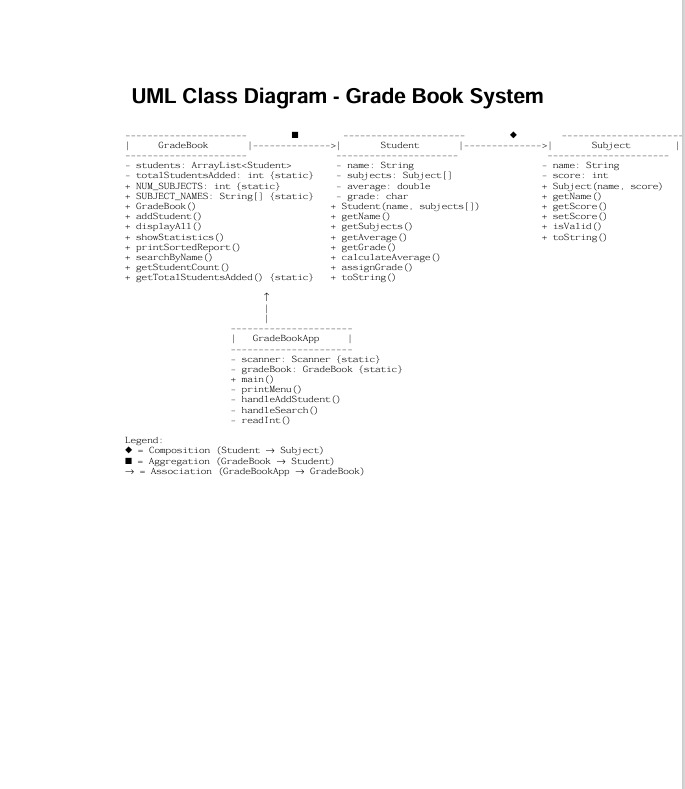
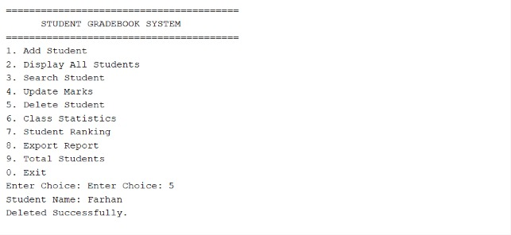
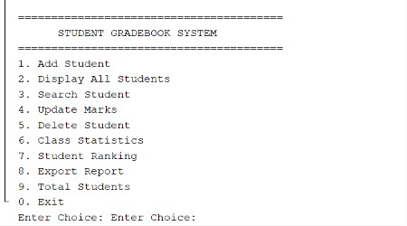
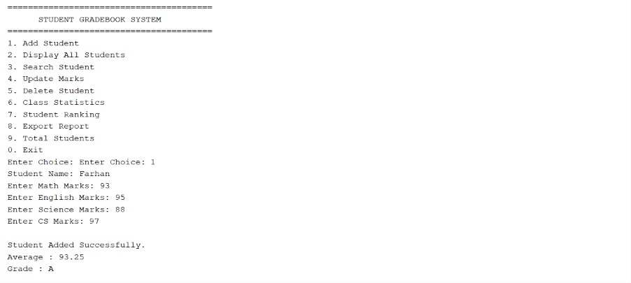

<div align="center">

# 🎓 Student Grade Management System

### A Java-based Grade Book Management System built using Object-Oriented Programming (OOP)


</div>

---

# 📖 About the Project

The **Student Grade Management System** is a console-based Java application developed using **Object-Oriented Programming (OOP)** principles. It provides an efficient way to manage student academic records by allowing users to add students, record subject marks, calculate averages, assign grades, search student records, and generate performance reports.

This project demonstrates clean software design through modular classes and practical implementation of Java OOP concepts.

---

# ✨ Features

- ➕ Add New Students
- 📚 Manage Multiple Subjects
- 📊 Automatic Average Calculation
- 🏆 Automatic Grade Assignment
- 🔍 Search Student by Name
- 📄 Generate Student Reports
- 📈 Display Overall Statistics
- ✅ Input Validation
- 💾 Dynamic Data Storage using ArrayList
- 🖥️ Interactive Console Menu

---

# 🛠 Technologies Used

| Technology | Purpose |
|------------|----------|
| Java | Programming Language |
| Object-Oriented Programming | Software Design |
| ArrayList | Dynamic Data Storage |
| Scanner | User Input |
| UML | System Design |
| Git | Version Control |
| GitHub | Project Hosting |

---

# 📂 Project Structure

```text
Student-grade/
│
├── images/
│   ├── image1.jpeg
│   ├── image2.jpeg
│   ├── image3.jpeg
│   ├── image4.jpeg
│   └── image5.jpeg
│
├── Student_grade.java
└── README.md
```

---

# 🏗 UML Class Diagram

The following UML Class Diagram illustrates the architecture and relationships between the major classes used in the system.

<p align="center">

</p>

---

# 📸 Project Screenshots

## 📌 UML Class Diagram

<p align="center">

</p>

---

## 🏠 System Overview

<p align="center">

</p>

---

## 📚 Student & Subject Management

<p align="center">

</p>

---

## 📊 Grade Calculation Flow

<p align="center">

</p>

---

## ⚙ Complete Class Relationships

<p align="center">

</p>

---

# 🧩 Core Classes

## 📘 GradeBook

Responsible for managing all student records.

### Responsibilities

- Add Students
- Display All Records
- Generate Reports
- Search Students
- Display Statistics

---

## 👨‍🎓 Student

Represents an individual student.

### Responsibilities

- Store Student Information
- Calculate Average
- Assign Grade
- Display Student Details

---

## 📖 Subject

Represents an academic subject and the obtained marks.

### Responsibilities

- Store Subject Name
- Store Marks
- Validate Input

---

## 🚀 GradeBookApp

Acts as the main controller of the application.

### Responsibilities

- Display Menu
- Handle User Input
- Call GradeBook Methods
- Control Program Flow

---

# 📚 Object-Oriented Concepts Used

- ✅ Encapsulation
- ✅ Abstraction
- ✅ Composition
- ✅ Aggregation
- ✅ Modularity
- ✅ Data Hiding
- ✅ Reusability

---

# 🚀 Getting Started

## Clone the Repository

```bash
git clone https://github.com/Naveed548376/Student-grade.git
```

## Navigate to the Project

```bash
cd Student-grade
```

## Compile

```bash
javac Student_grade.java
```

## Run

```bash
java Student_grade
```

---

# 🎯 Project Objectives

- Automate grade management
- Reduce manual calculation errors
- Demonstrate Java OOP concepts
- Organize student records efficiently
- Generate meaningful academic reports

---

# 🌟 Future Enhancements

- 🖥 Graphical User Interface (JavaFX/Swing)
- 🗄 Database Integration (MySQL/SQLite)
- 🔐 User Authentication
- 📄 Export Reports to PDF
- 📊 Excel Report Generation
- 👨‍🏫 Teacher Dashboard
- 👨‍🎓 Student Dashboard
- ☁ Cloud Storage
- 🌐 Web-Based Version
- 📱 Mobile Application

---

# 📈 Learning Outcomes

This project demonstrates:

- Java Programming
- Object-Oriented Programming
- UML Design
- Class Relationships
- Modular Programming
- Data Structures
- User Input Validation
- Software Engineering Principles

---

# 🤝 Contributing

Contributions are welcome.

1. Fork the repository
2. Create a new branch

```bash
git checkout -b feature-name
```

3. Commit your changes

```bash
git commit -m "Added new feature"
```

4. Push your branch

```bash
git push origin feature-name
```

5. Open a Pull Request

---

# 📄 License

This project is intended for **educational and learning purposes**.

---

# 👨‍💻 Author

**Naveed Abbas**

💻 Java Developer | Cyber Security Student

**GitHub:** https://github.com/Naveed548376

---

<div align="center">

## ⭐ If you found this project useful, don't forget to give it a star!

**"Clean code and clean design are the foundation of great software."**

</div>
